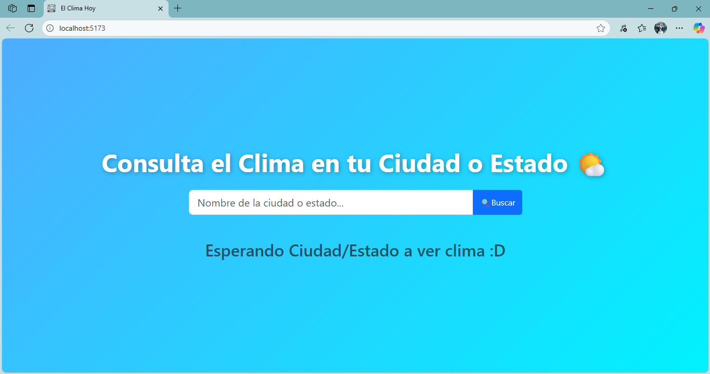
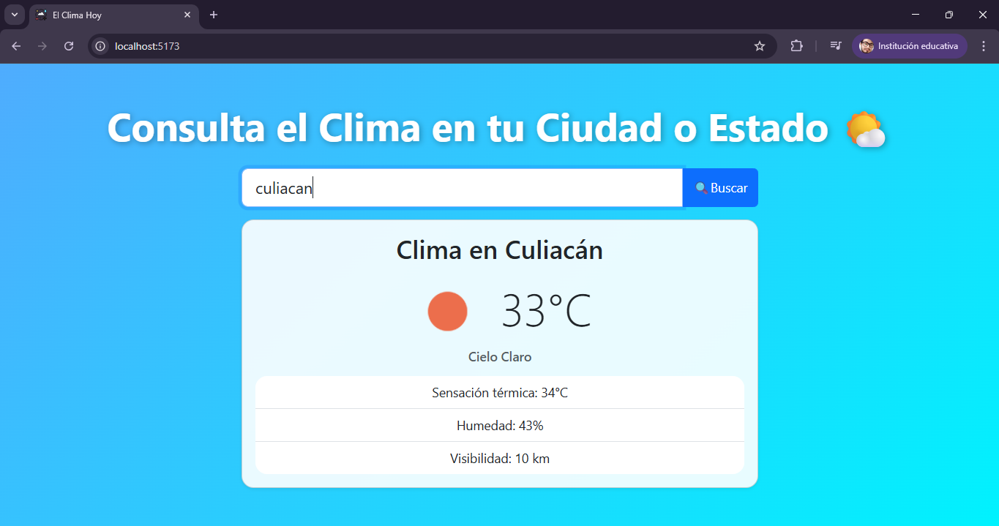

# API-Weather: Ver el Clima de tu ciudad/estado.

Sistema Web sencillo para consultar el clima y pronostico actual de una ciudad o de un estado, construido en **Node.JS** para el Back-End y **React + Vite** para el Front-End.

## 🔧Herramientas Utilizadas

 - VS Code (Compilador).
 - [OpenWeatherMap](https://openweathermap.org/api) (API Consumida).
 - Gemini y ChatGPT (De Apoyo).
 - Bootstrap/React-Bootstrap (Diseño).
 - Axios (Peticiones HTTP).

## ⚙️Inicializando el Sistema
### Prerrequisitos
- Node.JS Instalado (Ultima versón estable, incluye npm).
- Compilador instalado (VS Code).
- ApiKey (contar con cuenta en [OpenWeatherMap](https://openweathermap.org/) para obtener la llave).

### Instalación y Funcionamiento

 1. Clonar del repositorio de GitHub a tu maquina.
```
git clone <url-repositorio>
/tu-consola> cd api-clima
```
 2. Instalas las dependencias (en la terminal del compilador).
```
npm install
```
3. Configurar la variable de entorno.
	En base al archivo `.env.template` que se encuentra en la raíz del sistema, puedes crear el archivo y la variable de entorno que se necesita para el funcionamiento de la web:
```
#Agregar la ApiKey de tu cuenta
VITE_OPENWEATHER_API_KEY=Agregar-tu-clave.
```
4. Iniciar el sistema.
```
npm run start
```
ó
```
npm run dev
```
Por defecto inicializara en el puerto 5173, siendo: `http://localhost:5173/`

## 🧑🏻‍💻Uso del Sistema

 - Inicio de la página:
 
- Búsqueda del clima del lugar en la barra de búsqueda:


## 📝Notas del Proyecto

 - OpenWeatherMap, se eligió como API del sistema, ya que, cuenta con una configuración y presentación de los datos de forma directa, además de contar en su sitio un mapa para verificar sobre los datos del clima que se estan mostrando en el proyecto.
 
 - Respuesta rápida, pero depende de la velocidad de los servidores de la api y del internet donde se despliegue la aplicación.
 
 - No cuenta con búsqueda por nombres cortos/claves, esta pensado para que escribas el lugar especifico que se desea buscar, pero puedes escribir partes de ciudades y mostrar el lugar que estas deseando ver (ej. Juárez, muestra Ciudad Juárez).
